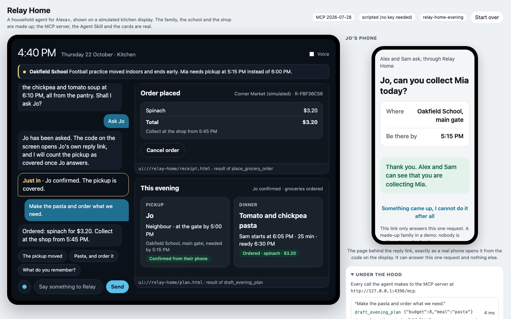
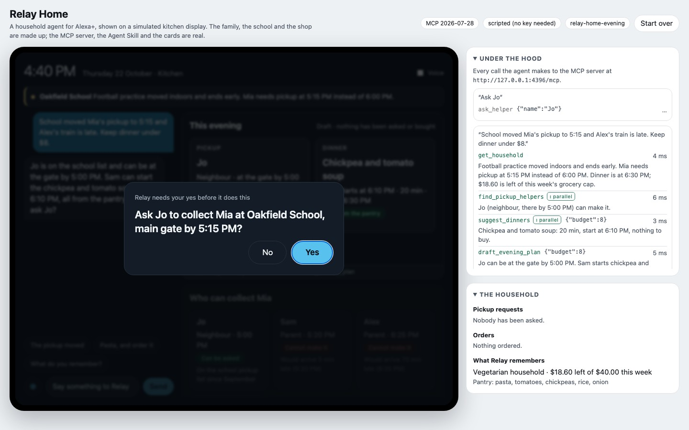

# Relay Home

**A changed pickup time should not derail the whole evening.** Relay Home is a household agent for Alexa+ that
rebuilds an evening after a change of plan: it works out who is allowed and able to collect the child, picks a dinner
that fits the pantry and the budget, and then asks before it requests anything from a person or spends any money.

It is three things that work together:

- a **self-hosted MCP server** over Streamable HTTP (protocol revision 2026-07-28, and still serving 2025-11-25 clients),
- an **Agent Skill** that tells an agent how to use it,
- a **simulated Alexa+ experience** in the browser: a conversation, a screen that shows the server's **MCP Apps** cards,
  and a panel that lists every MCP call the agent makes.

> **What is real and what is not.** The MCP server, the protocol traffic, the confirmation flow, the cards and the
> skill are real and run on your machine. The household, the school notice and the shop ("Corner Market") are made
> up. No message is sent to anyone and no money moves. The Alexa+ preview tools are not open to hackathon
> participants, so this has **not** been run on Alexa+; the browser page stands in for it, as the hackathon FAQ allows.

**Try it in the browser:** <https://relay-home.onrender.com> (a free instance: the first load can take up to a minute
while it wakes, and it runs the scripted model). **Demo video (2:44):** <https://youtu.be/W3LUTcaPIeE>. The file and its captions are on the [`media` branch](https://github.com/yy5652-hash/relay-home/tree/media);
[`docs/demo-video.md`](docs/demo-video.md) says how it was recorded and reproduces the conversation in it.



## Run it

Needs Node.js 22.9 or later and pnpm. Settings are optional; copy `.env.example` to `.env` to change any.

```bash
pnpm install
pnpm start
```

Open <http://localhost:4317>. No key and no account are needed.

Then try this, in order:

1. Click **The pickup moved**. Relay reads the household, checks helpers and dinners in parallel, and drafts a plan.
   Three cards appear on the screen; the panel on the right shows the four MCP calls behind them.
2. Click **Ask Jo** inside the card. Relay's question comes up as a confirmation sheet. Say **Yes**.
   The card now reads "Asked · waiting for an answer"; Relay does not call the pickup covered.
3. Under *The household*, click **Jo says yes** (you are playing Jo). The card changes to "Confirmed".
4. Click **Pasta, and order it**. Relay prices the missing spinach, asks you to confirm $3.20, and places the order.
   A receipt card appears and the evening card updates itself.
5. Ask **What do you remember?**, reload the page, and ask again: the household is kept between sessions.

Other things worth trying: say "No" on a confirmation sheet (nothing happens, and the server does not put the question again);
"Jo can't make it" (Jo is left out, and with nobody else eligible the plan is blocked and names no one);
"Keep dinner under $2 and 20 minutes"; "Set the weekly cap to $22" and then try to order.

Run the tests with `pnpm test` (30 tests: the rules, the MCP server in memory, the real HTTP endpoint on both protocol
revisions, the agent, the model adapters).

## Host it

`render.yaml` describes one free web service on Render, built from the `Dockerfile` (health check `/api/health`).
The server answers only to its own public name, which Render passes in `RENDER_EXTERNAL_HOSTNAME`; elsewhere set
`HOST=0.0.0.0` and `RELAY_ALLOWED_HOSTS=your.host.name`. A free instance sleeps when idle and has no disk, so the
demo households start fresh after a restart. Without a model key the hosted page runs the scripted model. Our own
copy runs at <https://relay-home.onrender.com>, and its MCP endpoint is `https://relay-home.onrender.com/mcp`.

## Connect your own MCP client

The endpoint is `http://localhost:4317/mcp`. Each visitor gets their own household and a bearer token for it:

```bash
curl -s -X POST http://localhost:4317/api/session -H 'content-type: application/json' -d '{}'
```

Use the returned `token` as `Authorization: Bearer <token>`. Any MCP client that speaks Streamable HTTP can list and
call the tools, for example:

```bash
curl -s -X POST http://localhost:4317/mcp \
  -H "authorization: Bearer $TOKEN" -H 'content-type: application/json' \
  -H 'accept: application/json, text/event-stream' \
  -d '{"jsonrpc":"2.0","id":1,"method":"tools/call","params":{"name":"get_household","arguments":{}}}'
```

## The tools

| Tool | What it does | Changes anything? | Card |
|---|---|---|---|
| `get_household` | The notice, the pickup list, dinner slot, pantry, memory, open requests, orders | no | |
| `find_pickup_helpers` | Checks every adult against the school list, their calendar and travel time, with reasons | no | helpers |
| `suggest_dinners` | Ranks meals by pantry coverage within time, diet and what is left of the weekly cap | no | dinners |
| `draft_evening_plan` | Puts pickup and dinner into one stored draft | draft only | evening |
| `ask_helper` | Records a pickup request to an eligible person | **needs a yes** | evening |
| `record_helper_reply` | Stores the helper's answer; a "no" removes them from today's plans | yes | evening |
| `withdraw_pickup_request` | Takes back an unanswered request | **needs a yes** | evening |
| `quote_groceries` | Prices the missing items; returns a signed ten-minute quote | no | |
| `place_grocery_order` | Buys exactly the quoted items | **needs a yes** | receipt |
| `cancel_grocery_order` | Cancels an order and returns the amount to the cap | **needs a yes** | receipt |
| `update_preferences` | Changes the diet preference or the weekly grocery cap | **needs a yes** | |
| `confirm_action` | Redeems a confirmation ticket (for clients that cannot be asked directly) | **needs a ticket** | |

## How the parts work

**Rules live in the server, not in the model.** Only someone on the school pickup list who can arrive in time may be
asked. With nobody eligible the plan is blocked and names no one. A pickup is "awaiting reply" until the helper
answers. An order must match a quote the server signed (HMAC), for the exact total, within the weekly cap, and a
repeated call with the same `orderKey` returns the same order instead of buying twice. An agent that ignores the skill
still cannot get past these; `test/` exercises each of them.



**Confirmation happens inside the protocol.** Every tool that does something for the household (asking a helper,
taking a request back, buying, cancelling an order, changing the weekly cap) first answers `input_required`
with a question for the person (the multi-round-trip pattern of the 2026-07-28 revision). The client shows the
question, and the retried call carries the answer together with the state the server sealed, so a yes cannot be
replayed for a different action. An answer that is not a yes ends the call with `done: false`. A 2025-11-25 client on
a stateless connection cannot be asked this way, so it receives a sealed five-minute ticket and redeems it with
`confirm_action` after the person agrees. Both paths run the same code once confirmed. See `src/mcp/server.js`.

**Cards are MCP Apps views.** Tools point at `ui://relay-home/*.html` resources. The simulator page is a real MCP Apps
host: it reads the resource from the server, puts it in a sandboxed frame, and talks to it through `AppBridge`.
A tap on a card does not act; it sends a message into the conversation, so every action still goes through the agent
and the confirmation. The evening card reads the household through the host every few seconds (read-only tools only),
which is how it shows "Confirmed" or "Ordered" without a new card. See `web/view.js`, `web/host.js`, `src/mcp/views.js`.

**The agent follows an Agent Skill.** `skills/relay-home-evening/` is a skill in the agentskills.io layout
(`SKILL.md` with front matter, plus references). The simulator's agent loads it as its instructions and reaches the
household only through the MCP endpoint, over HTTP, with the visitor's own token. See `src/agent/`.

**Which model drives the agent.** By default a small scripted model follows the skill, so the project runs without a
key and behaves the same every time. Set `GEMINI_API_KEY`, or `LLM_API_KEY` + `LLM_BASE_URL` + `LLM_MODEL` for any
OpenAI-compatible service, and a hosted model takes its place with the same skill and tools (see `.env.example`).
If the hosted model does not answer, the scripted one takes that turn and the page says so. Both adapters are
tested against each service's wire format with a stand-in for the network, and the Gemini one has been run live
(`gemini-3.5-flash-lite`, free tier); see "Limits" below.

**State across sessions.** Each household is one JSON file under `.data/`, written atomically. The token is the
sealed household id; the page keeps it in the browser, so a reload or a second MCP client sees the same evening.

## Layout

```
src/domain/     the household, the planner, the actions and their rules, the store
src/mcp/        the MCP server (12 tools) and the ui:// views
src/agent/      the agent loop, the skill loader, the scripted model, the hosted-model adapters
src/http.js     /mcp behind bearer auth, the chat stream, the endpoints the page uses
skills/         the Agent Skill
web/            source of the card code and of the page's host code (bundled by `pnpm build`)
public/         the simulator page
test/           30 tests
docs/           product feedback and friction log, submission text
```

`dist/view.js` and `public/host.js` are build outputs that are committed, so running needs no build step.

## Limits

- Not run on Alexa+. Whether Alexa+ renders MCP Apps views, answers `input_required`, or loads this skill the way the
  simulator does is unknown to us.
- The household, calendar, travel times, shop and prices are fixed demo data. No calendar, messaging or shop service
  is connected, and Relay never contacts the helper; someone has to tell it what the helper answered.
- The scripted model understands a limited set of sentences. The Gemini adapter has been run against the live
  service; the OpenAI-compatible adapter only against the wire format.
- The bearer token is a signed household id for a demo, not an OAuth flow. Do not put real personal data in it.
- No user research: nobody outside the project has tried it, and no time saving has been measured.

## Licence

MIT. Dependencies: the MCP TypeScript SDK packages and `@modelcontextprotocol/ext-apps` (MIT), Express (MIT), Zod (MIT).
AI coding assistance was used to write this project.
